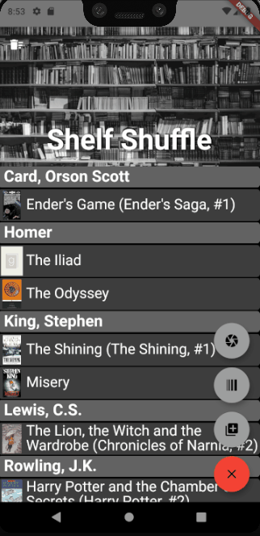
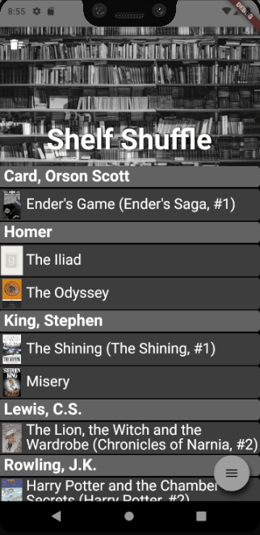
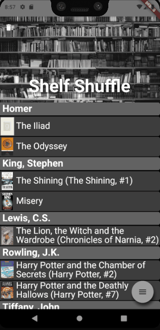
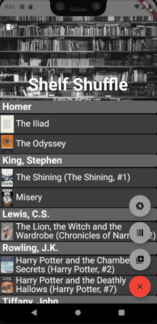
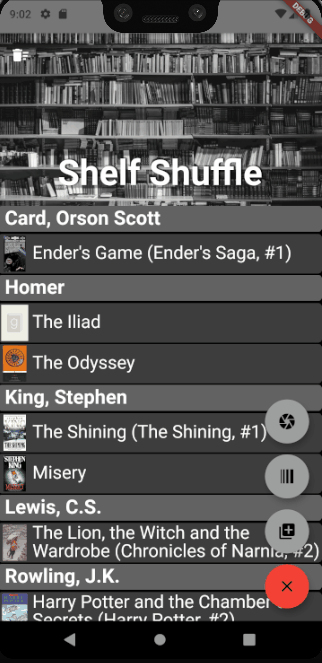
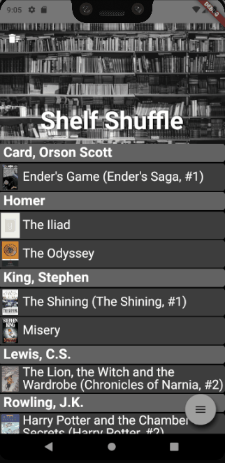

# Shelf Shuffle

Imagine taking a picture of your bookshelf, and instantly being presented with a list of books to add to your mobile library, without ever having to pick up a single book.  Just swipe left to discard a book, and swipe right to add a book to your library.  Shelf Shuffle’s custom machine learning models will use the Firebase Vision API and Tensorflow Lite title object detection models to scoop up whole shelves of books at a time, and store them on your device with just a few swipes.  You can then quickly browse your book list, edit details, or make notes completely on-device.

Shelf Shuffle does offer basic book scanning options like barcode scanning, or manually entering titles/ISBNs.  But, Shelf Shuffle also allows people with physical book collections to quickly, easily, and privately catalog all their books on their mobile devices--without having to enter every book on your shelf individually.  Utilizing on-device machine learning models and a simple clean UI, users will be able to quickly scan even large libraries of books and then view, manage, save, grow, and share their library with others.

Shelf Shuffle aims to give users the simplicity, speed, and privacy of an entirely on-device book tracking solution. The app does integrate with Google Books API and Goodreads APIs which are used to anonymously query detailed information about newly added books, but users' book lists and camera images will never leave their mobile device.  Using on-device machine learning, the app is able to detect and identify your book titles using only your local hardware and camera--providing a fast, secure, simple solution.

Note: Shelf Shuffle is just a working title for now and may change before release.

## Getting Started

You can download the full codebase for the Shelf Shuffle project at [https://github.com/dannydabbles/ShelfShuffle](https://github.com/dannydabbles/ShelfShuffle).

**App UI Samples**
<table>
  <tr>
    <td></td>
    <td></td>
  </tr>
  <tr>
    <td></td>
    <td></td>
  </tr>
  <tr>
    <td></td>
    <td></td>
  </tr>
  <tr>
    <td></td>
    <td></td>
  </tr>
  <tr>
    <td></td>
  </tr>
</table>

## Android Developer Challenge

This app is being submitted for consideration to the [Android Developer Challenge](https://developer.android.com/dev-challenge).  You can find my submission documents below:

**Cover Letter:** [Shelf Shuffle: Android Dev Challenge - Cover Letter](images/shelf_shuffle_android_dev_challenge_cover_letter.pdf)

## On Flutter and Dart

Working with React Native in my day-to-day work has given me an appreciation for just how complicated cross-platform development can be.  So, when I heard that Dart/Flutter could make cross-platform development both easier and more performant, I jumped at the chance to play with the framework.

Having worked with Dart/Flutter for several weeks now, I can say it has been one of the best experiences in over a decade as a Software Engineer.  The flutter widget paradigm is a game-changer (I always hated CSS), and hot-reload is a miracle.  Being able to have such a short loop from coming up with an idea to seeing it on the screen is amazing, and a testament to the dart language.

## App History

For years my wife has asked me for an app to help track her physical book collection.  She's an avid reader who never cared much for ebooks.  So, over the years, she has tried most book tracking tools on the market.  However, they were all either too difficult, too buggy, or too slow to use and each was abandoned over time in turn.

In particular, her main feature requests were:
1. A clean, simple, and intuitive user interface.
1. The ability to quickly scan a shelf of books without having to pick up each book to expose the front cover.
1. The ability to import/export saved library data to a simple file.
1. No requirement to log in to anything or otherwise create credentials.

...These are now the core ideas behind the Shelf Shuffle app.  While I welcome feedback from any and all users of the app, it's been very helpful to have such an amazing and engaged "in-house" alpha tester in my wonderful wife.

## App Roadmap

The app is in the proof-of-concept stage at this point, but contains a working prototype written using Dart and Flutter.  Most of the remaining work is just polishing the UI, adding convenience features, and improving the machine learning tooling.  For the UI and feature work, I’ll defer to my [GitHub issue page](https://github.com/dannydabbles/ShelfShuffle/issues).  But for the machine learning work, I’ll need the help of experienced machine learning developers.

Currently, I’m [using the Firebase Vision API’s text recognition tooling to find book titles in an image](https://github.com/dannydabbles/ShelfShuffle/blob/master/lib/title_finder.dart#L30).  This provides a [list of text blocks](https://github.com/dannydabbles/ShelfShuffle/blob/master/lib/main.dart#L455) that I can use to [query for detailed book information](https://github.com/dannydabbles/ShelfShuffle/blob/master/lib/main.dart#L456).  However, in practice the text returned by MLKit includes a lot of cruft that tends to yield incorrect or empty query results.

## Built With

* [Flutter](https://flutter.dev/)
* [Dart](https://dart.dev/)
* [ML Kit for Firebase](https://firebase.google.com/docs/ml-kit/)
* [Tensorflow Lite](https://www.tensorflow.org/lite) #TODO

## License and Contributing

This project currently uses at standard sopyright license.

I would more than welcome collaboration on this project, and along with that a more permissive license.  So, if anyone is interested, please [shoot me an email](mailto:danny@dannydabbles.com).

## Author

**Danny**
* [DannyDabbles GitHub Page](https://github.com/dannydabbles)
* [DannyDabbles Website](https://dannydabbles.com/about-me/)

## Acknowledgments

* Thank you to my caring wife Lora for her love, support, and testing too! <3
* Thank you to the Android Google team for reviewing my application to the Android Developer Challenge.
* Thank you to the Dart and Flutter Google team's for creating such an awesome framework.
